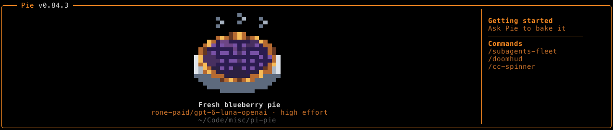

# Pi Pie

A pixel-art pie splash header for the Pi coding agent.



## Install

```bash
pi install npm:pi-pie
```

The next TUI session gets a randomly chosen pie filling and view, animated steam, model and thinking details, the current working directory, and useful Pi commands.

## Pie Collection

Pi Pie includes apple lattice, Dutch apple streusel, blueberry braid, cherry leaf cutouts, lemon meringue, pecan, and smooth orange pumpkin art. Views include a three-quarter pie, side profile, slice-removed pie, and fluted tin.

[See the Full Pie Selection](https://kylelavorato.github.io/pi-pie/pie-selection.html)

## Export the gallery

Generate a self-contained HTML gallery, then open it locally:

```bash
npm run gallery -- ./docs/pie-selection.html
open ./docs/pie-selection.html
```

## Development

```bash
npm install
npm test
npm run typecheck
```

## Publishing

```bash
npm login
npm whoami
npm run typecheck
npm test
npm pack --dry-run
npm publish
```

After publishing, verify the version and install it with:

```bash
npm view pi-pie version
pi install npm:pi-pie
```
